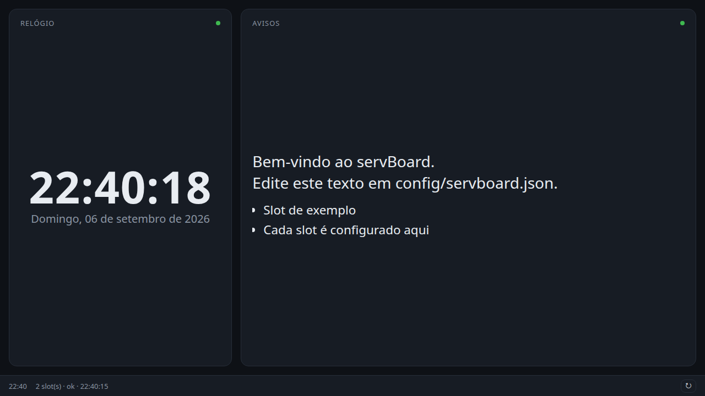

# servBoard

Dashboard gráfica para um servidor doméstico com monitor. Fica **sempre ligada**
em tela cheia (Chromium em modo kiosk) e mostra **slots** de conteúdo
independentes, cujos dados são reatualizados a cada X minutos (configurável).

Esta é a **base**. Cada slot ganha sua lógica própria depois; já vêm dois de
exemplo (`clock`, `notes`).



## Como funciona

```
config/servboard.json
        │
        ▼
servboard serve (Fastify)  ──►  loop de refresh a cada refresh.everyMinutes
        │                              │  roda o refresh() de cada slot
        │                              ▼
        │                       data/cache/<slot>.json
        ▼                              │
página + cache  ◄──────────────────────┘  ──►  navegador kiosk (sempre aberto)
```

- **serve**: servidor web permanente. Serve a página e o cache **e** roda um loop
  interno que reatualiza os slots a cada `refresh.everyMinutes` (cada slot pode
  ter seu próprio ritmo via `refreshInterval` no `slot.json`).
- **kiosk**: Chromium em `--kiosk` apontando para o servidor local, sempre aberto.
- **refresh**: também existe como comando pontual (`servboard refresh`) para
  testar um slot na mão.

No deploy, `servboard install` cria dois serviços do systemd `--user`
(`servboard-web` + `servboard-kiosk`, ambos `Restart=always`). Nada de horários.

## Uso local (desenvolvimento)

```bash
npm install
node bin/servboard.js doctor      # valida ambiente e config
node bin/servboard.js refresh      # gera data/cache/*.json (uma vez)
node bin/servboard.js serve        # http://127.0.0.1:4870 + loop de refresh
node bin/servboard.js show         # serve + refresh inicial + navegador kiosk (Ctrl-C encerra)
npm test                           # testes unitários (node --test)
```

Sem `config/servboard.json`, usa `config/servboard.example.json`.

## Configuração — `config/servboard.json`

```jsonc
{
  "timezone": "America/Sao_Paulo",
  "server":  { "host": "127.0.0.1", "port": 4870 },
  "layout":  { "columns": 3, "gap": 16 },
  "display": {
    "browser": "auto",         // "auto" ou caminho de um Chromium
    "keepScreenOn": true,      // usa xset para manter o monitor sempre ligado (X11)
    "xDisplay": ":0"           // display X do monitor do servidor (usado nas units)
  },
  "refresh": {
    "everyMinutes": 15,        // intervalo padrão entre atualizações dos slots
    "onStart": true            // atualiza tudo assim que o servidor sobe
  },
  "slotPaths": [               // pastas extras de slots (além de ./slots)
    "../servboard-slots/slots" // relativo à raiz do projeto; aceita ~ e caminho absoluto
  ],
  "slots": [
    { "id": "clock", "enabled": true },
    { "id": "notes", "enabled": true, "title": "Avisos", "span": 2,
      "settings": { "text": "Olá", "items": ["a", "b"] } }
  ]
}
```

- `slots[].span` — quantas colunas o card ocupa no grid.
- `slots[].settings` — objeto livre, entregue ao `refresh(ctx)` do slot em `ctx.settings`.
- Reordenar a lista `slots` reordena o grid.
- `slotPaths` — ver [Slots num repo separado](#slots-num-repo-separado).
- `refresh.everyMinutes` é o ritmo padrão; um slot pode pedir outro com
  `"refreshInterval"` no `slot.json` (`"30s"`, `"5m"`, `"2h"` ou um número em minutos).

## Criar um slot

```bash
servboard new-slot energia                 # cria em ./slots (ou 1ª entrada de slotPaths)
servboard new-slot energia --path ../servboard-slots/slots
```

```
<pasta-de-slots>/<id>/
  slot.json    { "id": "<id>", "title": "...", "span": 1, "refreshInterval": "5m" }
  index.js     export async function refresh(ctx) { return { ... } }   // vira o cache
  view.js      export function render(el, data, ctx) { ... }           // opcional
  view.css     estilos do slot                                        // opcional
```

`slot.json` — `refreshInterval` é opcional; sem ele o slot segue o
`refresh.everyMinutes` global.

`ctx` no `refresh`:
`{ settings, config: { timezone }, now, logger, readState(), writeState(obj) }`.
`readState()`/`writeState()` guardam um JSON por slot em `data/state/<id>.json` —
para acumuladores (kWh do dia), médias móveis, "última vez que vi X" etc.
O valor retornado pelo `refresh` é serializado em `data/cache/<id>.json`
(`{ data, updatedAt, error }`).
Se o slot não tiver `view.js`, a UI mostra o JSON cru — útil enquanto se desenvolve.

`render(el, data, ctx)` recebe o container e o `data` do cache; pode devolver uma
função de limpeza (ex.: `clearInterval`). Veja `slots/clock/`.

Um slot só aparece na dashboard quando está **numa pasta de slots** E **listado em
`config.slots` com `enabled: true`**.

## Slots num repo separado

A pasta `slots/` do repositório tem só os exemplos (`clock`, `notes`). Os seus
slots ficam **fora daqui**, num repositório próprio (privado, se quiser), com a
mesma estrutura:

```
servboard-slots/            <- seu repo
  slots/
    energia/  { slot.json, index.js, view.js, view.css }
    agenda/   { ... }
```

Aponte a base para ele de uma destas formas (podem ser várias pastas):

```jsonc
// config/servboard.json
"slotPaths": ["../servboard-slots/slots"]
```
```bash
# ou por ambiente (separado por ":"), útil em scripts/systemd
SERVBOARD_SLOTS_PATH=/caminho/servboard-slots/slots servboard serve
```

Prioridade quando o mesmo `id` existe em mais de uma pasta:
`SERVBOARD_SLOTS_PATH` > `slotPaths` (na ordem) > `slots/` do repo. Assim um slot
seu pode **substituir** um exemplo. `servboard list` mostra de qual pasta veio cada slot.

No servidor: clone os dois repos lado a lado, `git pull` em cada um
independente. Atualizar a base nunca conflita com os seus slots.

## Deploy (dashboard sempre ativa)

Como o usuário que fica logado no monitor, na pasta do projeto:

```bash
./deploy/install.sh          # npm ci + doctor + gera/ativa os serviços do systemd --user
systemctl --user status servboard-web.service   # conferir
```

`servboard install` gera dois serviços do systemd `--user` a partir de
`config/servboard.json` — `servboard-web.service` (servidor + loop de refresh) e
`servboard-kiosk.service` (navegador), ambos `Restart=always`. Re-rode após mudar
a config. Requer uma sessão gráfica X11 no monitor e
`loginctl enable-linger <usuário>`. Instalações antigas (modelo de horários) têm
as units removidas automaticamente.

Detalhes, tabela de units e um `.xinitrc` mínimo para máquina sem desktop:
[`deploy/README.md`](deploy/README.md).

## CLI

```
servboard doctor                 valida ambiente e config
servboard refresh [--slot id]    roda o refresh dos slots e sai
servboard serve                  servidor web + loop de refresh (foreground)
servboard kiosk                  só o navegador em kiosk (foreground)
servboard show                   serve + refresh inicial + kiosk (foreground)
servboard list                   pastas de slots + estado do cache
servboard new-slot <id>          cria o esqueleto de um slot [--path <pasta>]
servboard install [--dry-run]    serviços do systemd --user a partir da config
servboard uninstall [--dry-run]  remove os serviços
```

`SERVBOARD_LOG_LEVEL=debug|info|warn|error` controla o log.

## Requisitos

- Node.js >= 20
- Chromium (`sudo apt install chromium`) para os modos `kiosk` / `show`
- sessão gráfica no monitor do servidor (X11 recomendado para manter a tela ligada)
